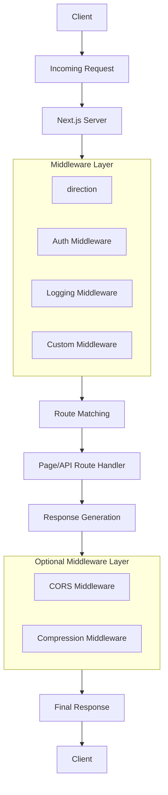
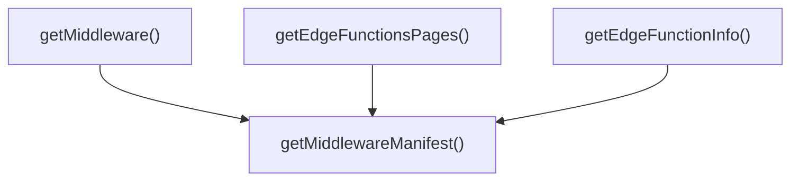
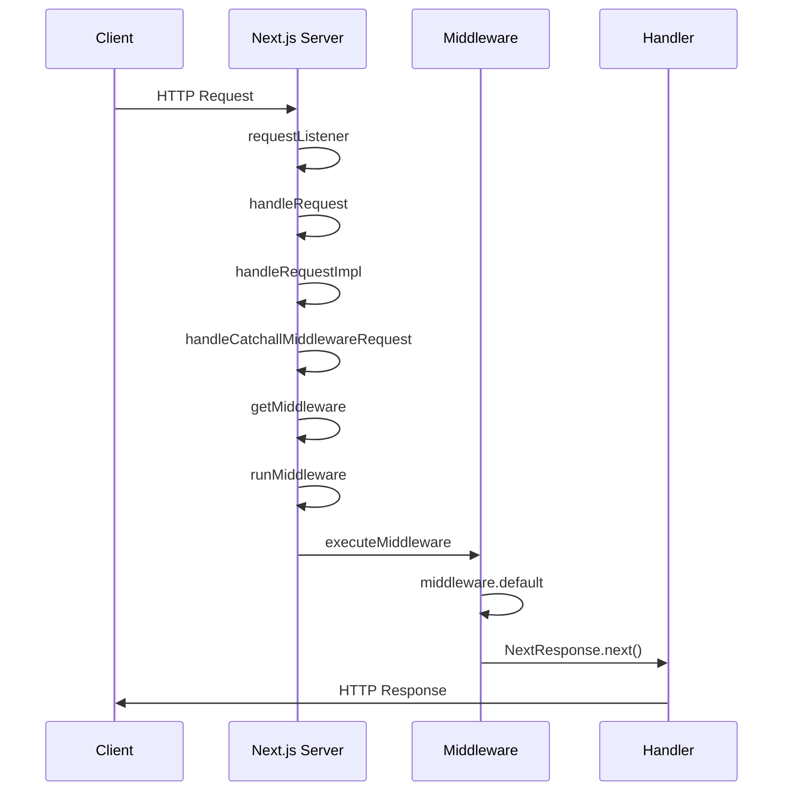

# Next.js middleware

**목차**

- Next.js 에서의 middleware?
- 실행 흐름
- 구조
- 흐름

## Next.js 에서의 middleware?

The middleware.js|ts file is used to write Middleware and run code on the server before a request is completed. Then, based on the incoming request, you can modify the response by rewriting, redirecting, modifying the request or response headers, or responding directly.

> [Next.js 공식문서 middleware.js](https://nextjs.org/docs/app/api-reference/file-conventions/middleware)

요청마다 중복되는 공통 로직들을 미들웨어를 적용하여 한 곳에서 관리할 수 있게 해줌. next.js는 라우트 매칭 및 캐시보다 앞서 실행됨(Edge Runtime)

## middleware flow



## 실행흐름

### 1. 서버 실행

```shell
next start
```

```typescript
/**
 * packages/next/src/bin/next.ts
 **/
const program = new NextRootCommand();

//ㅣine 96
program
  .name('next')
  .description('The Next.js CLI allows you to develop, build, start your application, and more.')
  .configureHelp({
    formatHelp: (cmd, helper) => formatCliHelpOutput(cmd, helper),
    subcommandTerm: cmd => `${cmd.name()} ${cmd.usage()}`,
  })
  .helpCommand(false)
  .helpOption('-h, --help', 'Displays this message.')
  .version(`Next.js v${process.env.__NEXT_VERSION}`, '-v, --version', 'Outputs the Next.js version.');

//line 324
program
  .command('start')
  .description('Starts Next.js in production mode. The application should be compiled with `next build` first.')
  .argument('[directory]', `A directory on which to start the application. ${italic('If no directory is provided, the current directory will be used.')}`)
  .addOption(new Option('-p, --port <port>', 'Specify a port number on which to start the application.').argParser(parseValidPositiveInteger).default(3000).env('PORT'))
  .option('-H, --hostname <hostname>', 'Specify a hostname on which to start the application (default: 0.0.0.0).')
  .addOption(new Option('--keepAliveTimeout <keepAliveTimeout>', 'Specify the maximum amount of milliseconds to wait before closing inactive connections.').argParser(parseValidPositiveInteger))
  .action((directory: string, options: NextStartOptions) => import('../cli/next-start.js').then(mod => mod.nextStart(options, directory)))
  .usage('[directory] [options]');
```

next start 명령어 실행 시 cli를 들고와 각 매치되는 체인을 실행시킵니다. 우리가 탐구할 주제는 middleware이니 start 커맨드에서 해당 라인을 살펴보겠습니다.

```typescript
.action((directory: string, options: NextStartOptions) => import('../cli/next-start.js').then(mod => mod.nextStart(options, directory)))
```

해당 함수를 통해 `../cli/next-start.js` 폴더에서 export 하고있는 nextStart를 실행시킵니다.

```typescript
/**
 * packages/next/src/cli/next-start.ts
 **/

import { startServer } from '../server/lib/start-server';

//line 18

/**
 * Start the Next.js server
 *
 * @param options The options for the start command
 * @param directory The directory to start the server in
 */
const nextStart = async (options: NextStartOptions, directory?: string) => {
  const dir = getProjectDir(directory);
  const hostname = options.hostname;
  const port = options.port;
  const keepAliveTimeout = options.keepAliveTimeout;

  if (isPortIsReserved(port)) {
    printAndExit(getReservedPortExplanation(port), 1);
  }

  await startServer({
    dir,
    isDev: false,
    hostname,
    port,
    keepAliveTimeout,
  });
};
```

해당 함수는 `isPrtIsReserved`를 통해 예약된 포트인지 검사 후 이슈가 없다면 startServer함수를 실행시킵니다.

이후 next.js는 startServer함수를 통해 서버를 실행킵니다.

```typescript
/**
 * packages/next/src/cli/start-server.ts
 **/

export async function startServer(
  serverOptions: StartServerOptions
): Promise<void> {
  ...
  await new Promise<void>((resolve) => {
    ...
    const initResult = await getRequestHandlers({
  }
}

export async function getRequestHandlers({
  ...
}: {
...
}): ReturnType<typeof initialize> {
  return initialize({
   ...
  })
}
```

이후 initialize를 통해 next() 플로우를 실행시키며, 이로인해 createServer 함수가 호출되어 NextServer가 실행됩니다.

```typescript
/**
 *  * packages/next/src/server/lib/render-server.ts
 */
//line 72
async function initializeImpl(opts: {
  ...
  const server = next({
    ...opts,
    hostname: opts.hostname || 'localhost',
    customServer: false,
    httpServer: opts.server,
    port: opts.port,
  }) as NextServer // should return a NextSe
  ...
}

/**
 *  * packages/next/src/server/next.ts
 */
//line 486
function createServer(
  options: NextServerOptions & {
    turbo?: boolean
    turbopack?: boolean
  }
): NextWrapperServer {
  ...
  return new NextServer(options)
}

//line 111
  private async createServer(
    options: ServerOptions | DevServerOptions
  ): Promise<NextNodeServer> {
    let ServerImplementation: typeof NextNodeServer
    if (options.dev) {
      ServerImplementation = require('./dev/next-dev-server')
        .default as typeof import('./dev/next-dev-server').default
    } else {
      ServerImplementation = await getServerImpl()
    }
    const server = new ServerImplementation(options)

    return server
  }
}

//line 37
const getServerImpl = async () => {
  if (ServerImpl === undefined) {
    ServerImpl = (await Promise.resolve(require('./next-server'))).default
  }
  return ServerImpl
}
```

<br/>

---

### 2. middleware 실행

위 과정을 통하여 `'./next-server'`에 있는 NextNodeServer까지 접근할 수 있었습니다.

이제 해당 클래스에서는 어떻게 middleware.ts를 찾고 이를 세팅하는지 확인해보겠습니다.

```typescript
export default class NextNodeServer extends BaseServer<
  Options,
  NodeNextRequest,
  NodeNextResponse
> {
  protected middlewareManifestPath: string
  ...
  constructor(option:Options) {
    ...
    this.middlewareManifestPath = join(this.serverDistDir, MIDDLEWARE_MANIFEST)
    ...
  }
  ...
  protected getMiddlewareManifest(): MiddlewareManifest | null {
    if (this.minimalMode) {
      return null
    } else {
      const manifest: MiddlewareManifest = require(this.middlewareManifestPath)
      return manifest
    }
  }
  ...
    /** Returns the middleware routing item if there is one. */
  protected async getMiddleware(): Promise<MiddlewareRoutingItem | undefined> {
    ...
  }
  ...
  protected getEdgeFunctionsPages(): string[] {
    const manifest = this.getMiddlewareManifest()
    if (!manifest) {
      return []
    }

    return Object.keys(manifest.functions)
  }

  protected getEdgeFunctionInfo(params: {
    page: string
    /** Whether we should look for a middleware or not */
    middleware: boolean
  }){
    const manifest = this.getMiddlewareManifest()
  }


}
```

이제 `middleware` 관련 소스를 파헤쳐보겠습니다.

#### 2.1. middleware manifest path 생성

```typescript
this.middlewareManifestPath = join(this.serverDistDir, MIDDLEWARE_MANIFEST);
```

우슨 `middlewareManifestPath`를 생성합니다. getter로 등록된 `this.serverDistDir`를 사용해 Next.js 배포된 서버 디렉토리 경로를 가져옵니다.

```typescript
protected get serverDistDir(): string {
  if (this._serverDistDir) {
    return this._serverDistDir
  }
  const serverDistDir = join(this.distDir, SERVER_DIRECTORY)
  this._serverDistDir = serverDistDir
  return serverDistDir
}

/**
 * ex) {project_root}/.next/server 서버 관련 파일들이 저장되는 디렉토리
 */
```

이후 `middleware-manifest.json` 경로와 조합하여 `middlewareManifestPath`경로를 완성합니다.

```bash
예시) ./.next/server/middleware-manifest.json'
```

#### 2.2 getMiddlewareManifest를 사용하는 NextNodeServer의 메서드들

```typescript
protected getMiddlewareManifest(): MiddlewareManifest | null {
  if (this.minimalMode) {
    return null
  } else {
    const manifest: MiddlewareManifest = require(this.middlewareManifestPath)
    return manifest
  }
```

`getMiddlewareManifest` 메서드를 생성하며, 어디서든 가져올 수 있게 만듭니다.

> 캐시 로직이 없는 이유?
> node.js 에서 require로 로드된 모듈을 내부 캐시에 저장하기 떄문!

<br/>

**getMiddlewareManifest를 사용하는 메서드들**



**예시**

```typescript
// 1. getMiddlewareManifest
protected getEdgeFunctionsPages(): string[] {
  const manifest = this.getMiddlewareManifest()
  if (!manifest) {
    return []
  }
  return Object.keys(manifest.functions)
}

// 2.getEdgeFunctionsPages
const edgePages = this.getEdgeFunctionsPages()
console.log('엣지 함수가 있는 페이지들:', edgePages)
// 출력: ['/api/users', '/api/products', '/api/orders']

// 3. getEdgeFunctionInfo
const edgeInfo = this.getEdgeFunctionInfo({
  page: '/api/users',
  middleware: false
})

if (edgeInfo) {
  console.log('함수 이름:', edgeInfo.name)
  console.log('실행 파일:', edgeInfo.paths)
  console.log('환경 변수:', edgeInfo.env)
  console.log('에셋:', edgeInfo.assets)
}
```

이제 미들웨어에서 관련 코드들을 어떻게 가져올 수 있는지 알게 되었습니다.

#### 2.3 요청을 받고 middleware 실행



1. 서버 생성 시 등록된 `handleRequest` 호출
2. requestHandler가 요청을 받아 Next.js의 handleRequest로 전달
3. handleRequest에서 handleRequestImpl 호출
4. handleRequestImpl에서 handleCatchallMiddlewareRequest 처리 실행

```typescript
//next/src/server/base-server.ts

// line 992
private async handleRequestImpl(
req: ServerRequest,
res: ServerResponse,
parsedUrl?: NextUrlWithParsedQuery
): Promise<void> {
try {
  // 1. 매처 준비 대기
  await this.matchers.waitTillReady()

  // 2. 쿠키 처리
  patchSetHeaderWithCookieSupport(req, res)

  // 3. URL 정규화
  const urlParts = (req.url || '').split('?', 1)
  const urlNoQuery = urlParts[0]

  // 4. URL 파싱
  if (!parsedUrl) {
    parsedUrl = parseUrl(req.url!, true)
  }

  // 5. 요청 메타데이터 설정
  this.attachRequestMeta(req, parsedUrl)

  // 6. RSC 요청 처리
  let finished = await this.handleRSCRequest(req, res, parsedUrl)
  if (finished) return

  // 7. 미들웨어 처리
  if (process.env.NEXT_RUNTIME !== 'edge' && getRequestMeta(req, 'middlewareInvoke')) {
    finished = await this.normalizeAndAttachMetadata(req, res, parsedUrl)
    if (finished) return

    finished = await this.handleCatchallMiddlewareRequest(req, res, parsedUrl)
    if (finished) return
  }
  res.statusCode = 200
  return await this.run(req, res, parsedUrl)

} catch (err) {
  // 에러 처리
}
}
```

5.handleCatchallMiddlewareRequest 에서 getMiddleware로 미들웨어 정보 가져오고, runMiddleware 실행 후 응답을 가져온후 보내준다.

```typescript
protected handleCatchallMiddlewareRequest: NodeRouteHandler = async (
  req,
  res,
  parsed
) => {
  // 1. 미들웨어 호출 여부 확인
  // middlewareInvoke 메타데이터가 있는지 확인하여 미들웨어 처리가 필요한지 판단
  const isMiddlewareInvoke = getRequestMeta(req, 'middlewareInvoke')
  if (!isMiddlewareInvoke) {
    return false
  }

  // 2. 미들웨어 완료 핸들러 정의
  // 미들웨어 처리가 완료되었을 때 호출되는 함수
  const handleFinished = () => {
    addRequestMeta(req, 'middlewareInvoke', true)  // 미들웨어 호출 완료 표시
    res.body('').send()  // 빈 응답 전송
    return true
  }

  // 3. 미들웨어 정보 가져오기
  // getMiddleware()를 통해 현재 요청에 대한 미들웨어 정보를 가져옴
  const middleware = await this.getMiddleware()
  if (!middleware) {
    return handleFinished()  // 미들웨어가 없으면 완료 처리
  }

  // 4. URL 처리 및 정규화
  const initUrl = getRequestMeta(req, 'initURL')!  // 초기 URL 가져오기
  const parsedUrl = parseUrl(initUrl)  // URL 파싱
  const pathnameInfo = getNextPathnameInfo(parsedUrl.pathname, {
    nextConfig: this.nextConfig,
    i18nProvider: this.i18nProvider,
  })

  parsedUrl.pathname = pathnameInfo.pathname  // 정규화된 pathname 설정
  const normalizedPathname = removeTrailingSlash(parsed.pathname || '')  // trailing slash 제거
  let maybeDecodedPathname = normalizedPathname

  // 5. URL 디코딩 시도
  try {
    maybeDecodedPathname = decodeURIComponent(normalizedPathname)
  } catch {
    /* non-fatal we can't decode so can't match it */
  }

  // 6. 미들웨어 매칭 확인
  // 정규화된 pathname과 디코딩된 pathname 모두에 대해 미들웨어 매칭 시도
  if (
    !(
      middleware.match(normalizedPathname, req, parsedUrl.query) ||
      middleware.match(maybeDecodedPathname, req, parsedUrl.query)
    )
  ) {
    return handleFinished()  // 매칭되는 미들웨어가 없으면 완료 처리
  }

  // 7. 미들웨어 실행 준비
  let result: Awaited<ReturnType<typeof NextNodeServer.prototype.runMiddleware>>
  let bubblingResult = false

  try {
    // 8. 미들웨어 실행 전 준비
    await this.ensureMiddleware(req.url)

    // 9. 미들웨어 실행
    result = await this.runMiddleware({
      request: req,
      response: res,
      parsedUrl: parsedUrl,
      parsed: parsed,
    })

    // 10. 미들웨어 응답 처리
    if ('response' in result) {
      if (isMiddlewareInvoke) {
        bubblingResult = true
        throw new BubbledError(true, result)  // 미들웨어 체인에서 응답 버블링
      }

      // 11. 응답 헤더 설정
      for (const [key, value] of Object.entries(
        toNodeOutgoingHttpHeaders(result.response.headers)
      )) {
        if (key !== 'content-encoding' && value !== undefined) {
          res.setHeader(key, value as string | string[])
        }
      }
      res.statusCode = result.response.status

      // 12. 응답 본문 처리
      const { originalResponse } = res
      if (result.response.body) {
        await pipeToNodeResponse(result.response.body, originalResponse)
      } else {
        originalResponse.end()
      }
      return true
    }
  } catch (err: unknown) {
    // 13. 에러 처리
    if (bubblingResult) {
      throw err  // 버블링된 에러는 상위로 전파
    }

    if (isError(err) && err.code === 'ENOENT') {
      await this.render404(req, res, parsed)  // 404 에러 처리
      return true
    }

    if (err instanceof DecodeError) {
      res.statusCode = 400
      await this.renderError(err, req, res, parsed.pathname || '')  // 디코딩 에러 처리
      return true
    }

    // 14. 기타 에러 처리
    const error = getProperError(err)
    console.error(error)
    res.statusCode = 500
    await this.renderError(error, req, res, parsed.pathname || '')
    return true
  }

  return result.finished  // 미들웨어 실행 결과 반환
}
```
